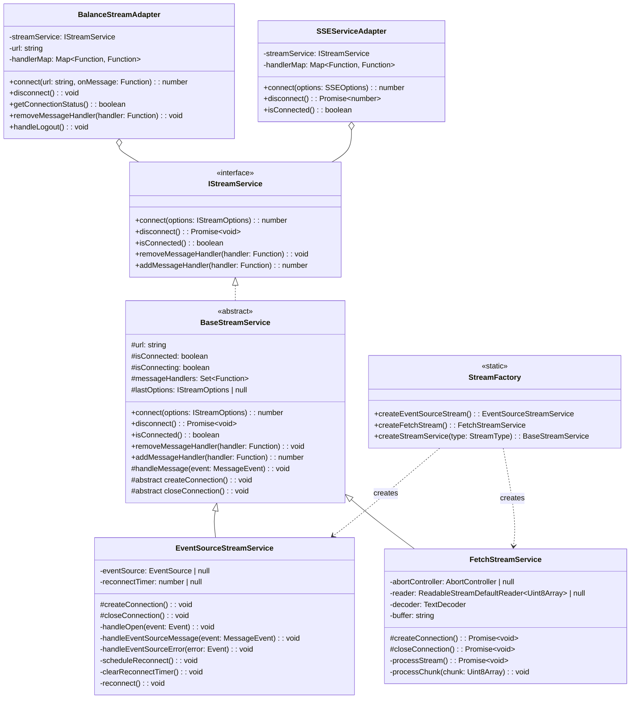

# Unified SSE Streaming Component Implementation Plan

## Overview

This document outlines the detailed implementation plan for creating a unified Server-Sent Events (SSE) streaming component that abstracts connection handling and event processing. The goal is to refactor both `balanceStreamService` and `sseService` to use this new component, removing duplicated code while maintaining current functionality.

## Current State Analysis

Currently, the project has two separate implementations for handling server-sent events:

1. **balanceStreamService**: Uses the native EventSource API to connect to balance stream endpoints. It handles reconnection, message parsing, and provides methods for connection management.

2. **sseService**: Uses a custom implementation with fetch API and stream reading to connect to SSE endpoints. It also handles reconnection, message parsing, and provides similar connection management methods.

Both services have similar functionality but different implementations, leading to code duplication and potential maintenance issues.

## Implementation Goals

1. Create a unified streaming component that abstracts connection handling and event processing
2. Support both EventSource and Fetch-based implementations
3. Maintain backward compatibility with existing code through adapters
4. Ensure proper error handling and reconnection logic
5. Maintain type safety throughout the implementation

## Architecture Design



## Directory Structure

```
src/services/stream/
├── base/
│   ├── BaseStreamService.ts
│   ├── EventSourceStreamService.ts
│   ├── FetchStreamService.ts
│   └── StreamFactory.ts
├── adapters/
│   ├── BalanceStreamAdapter.ts
│   └── SSEServiceAdapter.ts
├── types/
│   └── stream.ts
└── index.ts
```

## Implementation Steps

### 1. Create Directory Structure

First, we need to create the directory structure for our new unified streaming component:

```bash
mkdir -p src/services/stream/base
mkdir -p src/services/stream/adapters
mkdir -p src/services/stream/types
```

### 2. Define Common Interfaces and Types

Create `src/services/stream/types/stream.ts` with common interfaces and types for all stream services:

```typescript
/**
 * Common options for all stream connections
 */
export interface IStreamOptions {
  url: string;
  headers?: Record<string, string>;
  withCredentials?: boolean;
  onMessage?: (event: MessageEvent) => void;
  onError?: (error: Event) => void;
  onOpen?: (event: Event) => void;
  autoReconnect?: boolean;
  reconnectInterval?: number;
}

/**
 * Core stream service interface
 */
export interface IStreamService {
  connect(options: IStreamOptions): number;
  disconnect(): Promise<void>;
  isConnected(): boolean;
  removeMessageHandler(handler: Function): void;
  addMessageHandler(handler: Function): number;
}
```

### 3. Implement Base Stream Service

Create `src/services/stream/base/BaseStreamService.ts` with the abstract base class that implements common functionality:

```typescript
import { IStreamOptions, IStreamService } from '../types/stream';

/**
 * Abstract base class for stream services
 * Handles common functionality like connection state and message handlers
 */
export abstract class BaseStreamService implements IStreamService {
  protected url: string = '';
  protected isConnected: boolean = false;
  protected isConnecting: boolean = false;
  protected messageHandlers: Set<Function> = new Set();
  protected lastOptions: IStreamOptions | null = null;

  /**
   * Connect to a stream endpoint
   * @param options Connection options
   * @returns Number of registered handlers
   */
  connect(options: IStreamOptions): number {
    // If we're already connected to this URL, just add the message handler
    if (this.isConnected && this.lastOptions && this.lastOptions.url === options.url) {
      if (options.onMessage) {
        this.messageHandlers.add(options.onMessage);
      }
      return this.messageHandlers.size;
    }

    // If we're already connecting, just add the message handler
    if (this.isConnecting) {
      if (options.onMessage) {
        this.messageHandlers.add(options.onMessage);
      }
      return this.messageHandlers.size;
    }

    // Start connecting
    this.isConnecting = true;
    this.lastOptions = options;
    this.url = options.url;

    // Close any existing connection
    this.disconnect();

    // Add message handler
    if (options.onMessage) {
      this.messageHandlers.add(options.onMessage);
    }

    // Create the connection
    this.createConnection();

    return this.messageHandlers.size;
  }

  /**
   * Disconnect from the stream endpoint
   */
  async disconnect(): Promise<void> {
    await this.closeConnection();
    this.isConnected = false;
    this.isConnecting = false;
    this.messageHandlers.clear();
    this.lastOptions = null;
  }

  /**
   * Check if connected to the stream
   * @returns Connection status
   */
  isConnected(): boolean {
    return this.isConnected;
  }

  /**
   * Remove a message handler
   * @param handler The handler to remove
   */
  removeMessageHandler(handler: Function): void {
    this.messageHandlers.delete(handler);
  }

  /**
   * Add a message handler
   * @param handler The handler to add
   * @returns Number of registered handlers
   */
  addMessageHandler(handler: Function): number {
    this.messageHandlers.add(handler);
    return this.messageHandlers.size;
  }

  /**
   * Handle incoming messages
   * @param event The message event
   */
  protected handleMessage(event: MessageEvent): void {
    // Call all message handlers
    this.messageHandlers.forEach(handler => {
      handler(event);
    });
  }

  /**
   * Create the actual connection
   * Implemented by subclasses
   */
  protected abstract createConnection(): void;

  /**
   * Close the actual connection
   * Implemented by subclasses
   */
  protected abstract closeConnection(): void;
}
```

### 4. Implement EventSource Stream Service

Create `src/services/stream/base/EventSourceStreamService.ts` with the EventSource implementation:

```typescript
import { BaseStreamService } from './BaseStreamService';
import { IStreamOptions } from '../types/stream';

/**
 * Stream service implementation using the native EventSource API
 * Closely mirrors the behavior of the original balanceStreamService
 */
export class EventSourceStreamService extends BaseStreamService {
  private eventSource: EventSource | null = null;
  private reconnectTimer: number | null = null;

  /**
   * Create an EventSource connection
   */
  protected createConnection(): void {
    if (!this.lastOptions) {
      this.isConnecting = false;
      return;
    }

    try {
      // Create a new EventSource
      this.eventSource = new EventSource(this.url);

      // Set up event handlers
      this.eventSource.onopen = this.handleOpen.bind(this);
      this.eventSource.onmessage = this.handleEventSourceMessage.bind(this);
      this.eventSource.onerror = this.handleEventSourceError.bind(this);
    } catch (error) {
      this.isConnecting = false;
      console.error('EventSource Stream: Failed to create connection', error);
    }
  }

  /**
   * Close the EventSource connection
   */
  protected async closeConnection(): Promise<void> {
    this.clearReconnectTimer();
    
    if (this.eventSource) {
      this.eventSource.close();
      this.eventSource = null;
    }
  }

  /**
   * Handle connection open event
   */
  private handleOpen(event: Event): void {
    this.isConnected = true;
    this.isConnecting = false;
    
    if (this.lastOptions?.onOpen) {
      this.lastOptions.onOpen(event);
    }
  }

  /**
   * Handle EventSource message event
   */
  private handleEventSourceMessage(event: MessageEvent): void {
    try {
      // Call the base class handler which will notify all registered handlers
      this.handleMessage(event);
    } catch (error) {
      console.error('EventSource Stream: Error processing message', error);
    }
  }

  /**
   * Handle EventSource error event
   * Implements the same reconnection logic as the original balanceStreamService
   */
  private handleEventSourceError(error: Event): void {
    console.error('EventSource Stream: Connection error', error);
    this.isConnected = false;
    
    // Call error handlers if provided
    if (this.lastOptions?.onError) {
      this.lastOptions.onError(error);
    }
    
    // Try to reconnect after a delay (matching original balanceStreamService behavior)
    this.scheduleReconnect();
  }

  /**
   * Schedule a reconnection attempt
   */
  private scheduleReconnect(): void {
    this.clearReconnectTimer();
    
    // Use the same 5000ms delay as the original balanceStreamService
    const reconnectInterval = this.lastOptions?.reconnectInterval || 5000;
    
    this.reconnectTimer = window.setTimeout(() => {
      this.reconnect();
    }, reconnectInterval);
  }

  /**
   * Clear any pending reconnect timer
   */
  private clearReconnectTimer(): void {
    if (this.reconnectTimer !== null) {
      clearTimeout(this.reconnectTimer);
      this.reconnectTimer = null;
    }
  }

  /**
   * Attempt to reconnect
   */
  private reconnect(): void {
    if (this.eventSource) {
      this.eventSource.close();
      this.eventSource = null;
    }
    
    if (this.lastOptions) {
      this.createConnection();
    }
  }
}
```

### 5. Implement Fetch Stream Service

Create `src/services/stream/base/FetchStreamService.ts` with the Fetch implementation:

```typescript
import { BaseStreamService } from './BaseStreamService';

/**
 * Stream service implementation using fetch API and stream reading
 * Closely mirrors the behavior of the original sseService
 */
export class FetchStreamService extends BaseStreamService {
  private abortController: AbortController | null = null;
  private reader: ReadableStreamDefaultReader<Uint8Array> | null = null;
  private decoder = new TextDecoder();
  private buffer = '';

  /**
   * Create a fetch-based stream connection
   */
  protected async createConnection(): Promise<void> {
    if (!this.lastOptions) {
      this.isConnecting = false;
      return;
    }

    if (this.abortController) {
      if (!this.abortController.signal.aborted) {
        this.abortController.abort();
      }
      this.abortController = null;
    }
    
    this.buffer = '';
    this.abortController = new AbortController();

    try {
      const response = await fetch(this.url, {
        method: 'GET',
        headers: {
          'Accept': 'text/event-stream',
          'Cache-Control': 'no-cache',
          'Connection': 'keep-alive',
          ...this.lastOptions.headers
        },
        mode: 'cors',
        credentials: this.lastOptions.withCredentials ? 'include' : 'omit',
        signal: this.abortController.signal
      });

      if (!response.ok) {
        throw new Error(`HTTP error! status: ${response.status}`);
      }

      if (!response.body) {
        throw new Error('Response has no body');
      }

      // Connection is established
      this.isConnected = true;
      this.isConnecting = false;
      
      if (this.lastOptions.onOpen) {
        this.lastOptions.onOpen(new Event('open'));
      }

      const reader = response.body.getReader();
      this.reader = reader;

      try {
        await this.processStream();
      } catch (streamError) {
        if (streamError instanceof Error && streamError.name === 'AbortError') {
          console.log('Fetch Stream: Stream reading aborted');
          return;
        }
        throw streamError;
      }
    } catch (connectionError) {
      this.isConnected = false;
      this.isConnecting = false;
      
      if (connectionError instanceof Error && connectionError.name === 'AbortError') {
        console.log('Fetch Stream: Connection aborted');
        return;
      }
      
      console.error('Fetch Stream: Connection error:', connectionError);
      
      // Call error handlers if provided
      if (this.lastOptions?.onError) {
        this.lastOptions.onError(new ErrorEvent('error', { error: connectionError }));
      }
    }
  }

  /**
   * Process the stream data
   */
  private async processStream(): Promise<void> {
    if (!this.reader) return;
    
    try {
      while (true) {
        if (!this.reader) {
          console.log('Fetch Stream: Reader was closed');
          break;
        }

        const { value, done } = await this.reader.read();
        
        if (done) {
          console.log('Fetch Stream: Stream complete');
          break;
        }

        this.processChunk(value);
      }
    } catch (error) {
      if (error instanceof Error && error.name === 'AbortError') {
        return;
      }
      throw error;
    }
  }

  /**
   * Process a chunk of data from the stream
   * Follows the same parsing logic as the original sseService
   */
  private processChunk(chunk: Uint8Array): void {
    const decodedText = this.decoder.decode(chunk, { stream: true });
    this.buffer += decodedText;
    const lines = this.buffer.split('\n');
    this.buffer = lines.pop() || '';

    for (const line of lines) {
      if (line.trim() === '') continue;
      
      if (line.startsWith('data: ')) {
        const data = line.slice(6).trim();

        if (data.includes('heartbeat')) {
          this.handleMessage(new MessageEvent('message', { 
            data: JSON.stringify({ type: 'heartbeat' })
          }));
          continue;
        }

        try {
          // Validate JSON but pass original data (matching original sseService behavior)
          JSON.parse(data);
          this.handleMessage(new MessageEvent('message', { data }));
        } catch (parseError) {
          console.warn('Fetch Stream: Invalid JSON:', data, parseError);
        }
      }
    }
  }

  /**
   * Close the fetch connection
   */
  protected async closeConnection(): Promise<void> {
    if (this.reader) {
      try {
        await this.reader.cancel();
      } catch (error) {
        console.warn('Fetch Stream: Error canceling reader:', error);
      }
      this.reader = null;
    }

    if (this.abortController) {
      try {
        if (!this.abortController.signal.aborted) {
          this.abortController.abort();
        }
      } catch (error) {
        console.warn('Fetch Stream: Error aborting connection:', error);
      }
      this.abortController = null;
    }

    this.buffer = '';
  }
}
```

### 6. Implement Stream Factory

Create `src/services/stream/base/StreamFactory.ts` with the factory class:

```typescript
import { EventSourceStreamService } from './EventSourceStreamService';
import { FetchStreamService } from './FetchStreamService';
import { BaseStreamService } from './BaseStreamService';

/**
 * Stream type enum
 */
export enum StreamType {
  EVENT_SOURCE,
  FETCH
}

/**
 * Factory for creating stream services
 */
export class StreamFactory {
  /**
   * Create an EventSource-based stream service
   * @returns A new EventSourceStreamService instance
   */
  static createEventSourceStream(): EventSourceStreamService {
    return new EventSourceStreamService();
  }
  
  /**
   * Create a fetch-based stream service
   * @returns A new FetchStreamService instance
   */
  static createFetchStream(): FetchStreamService {
    return new FetchStreamService();
  }
  
  /**
   * Create a stream service based on the specified type
   * @param type The type of stream service to create
   * @returns A new stream service instance
   */
  static createStreamService(type: StreamType): BaseStreamService {
    switch (type) {
      case StreamType.EVENT_SOURCE:
        return StreamFactory.createEventSourceStream();
      case StreamType.FETCH:
        return StreamFactory.createFetchStream();
      default:
        throw new Error(`Unknown stream type: ${type}`);
    }
  }
}
```

### 7. Implement Balance Stream Adapter

Create `src/services/stream/adapters/BalanceStreamAdapter.ts` with the balance stream adapter:

```typescript
import { BalanceData } from '../../../types/balance';
import { IStreamService } from '../types/stream';

// Type for the balance stream message handler
type BalanceStreamMessageHandler = (data: BalanceData) => void;

/**
 * Adapter for the balance stream service
 * Provides the same API as the original balanceStreamService
 */
export class BalanceStreamAdapter {
  private streamService: IStreamService;
  private url: string = '';
  private handlerMap = new Map<BalanceStreamMessageHandler, Function>();

  constructor(streamService: IStreamService) {
    this.streamService = streamService;
  }

  /**
   * Connect to the balance stream endpoint
   * @param url The URL of the balance stream endpoint
   * @param onMessage The message handler function
   * @returns The number of registered message handlers
   */
  connect(url: string, onMessage: BalanceStreamMessageHandler): number {
    this.url = url;
    
    // Create a wrapper function to transform the data
    const messageHandler = (event: MessageEvent) => {
      try {
        // Parse the JSON data
        const data = JSON.parse(event.data);
        
        // Extract the balance data using the same logic as the original balanceStreamService
        let balanceData: BalanceData;
        
        if (data && data.data && data.data.balance) {
          // Structure from SSE service
          balanceData = {
            balance: data.data.balance,
            change: data.data.change || '0.00',
            contract_id: data.data.contract_id || '',
            currency: data.data.currency || 'USD',
            timestamp: data.data.timestamp || new Date().toISOString()
          };
        } else if (data && data.balance) {
          // Direct balance object
          balanceData = {
            balance: data.balance,
            change: data.change || '0.00',
            contract_id: data.contract_id || '',
            currency: data.currency || 'USD',
            timestamp: data.timestamp || new Date().toISOString()
          };
        } else {
          console.error('Balance Stream: Invalid data format', data);
          return;
        }
        
        // Call the original handler with the transformed data
        onMessage(balanceData);
      } catch (error) {
        console.error('Balance Stream: Error processing message', error);
      }
    };
    
    // Store the mapping between the original handler and the wrapper
    this.handlerMap.set(onMessage, messageHandler);
    
    // Connect using the stream service
    return this.streamService.connect({
      url,
      onMessage: messageHandler
    });
  }

  /**
   * Disconnect from the balance stream endpoint
   */
  disconnect(): void {
    this.streamService.disconnect();
    this.handlerMap.clear();
  }

  /**
   * Check if the balance stream is connected
   * @returns True if connected, false otherwise
   */
  getConnectionStatus(): boolean {
    return this.streamService.isConnected();
  }

  /**
   * Remove a message handler
   * @param handler The message handler to remove
   */
  removeMessageHandler(handler: BalanceStreamMessageHandler): void {
    const wrappedHandler = this.handlerMap.get(handler);
    if (wrappedHandler) {
      this.streamService.removeMessageHandler(wrappedHandler);
      this.handlerMap.delete(handler);
    }
  }

  /**
   * Disconnect and reset all state when user logs out
   */
  handleLogout(): void {
    this.disconnect();
    this.url = '';
  }
}
```

### 8. Implement SSE Service Adapter

Create `src/services/stream/adapters/SSEServiceAdapter.ts` with the SSE service adapter:

```typescript
import { SSEOptions, SSEService } from '../../../types/sse';
import { IStreamService } from '../types/stream';

/**
 * Adapter for the SSE service
 * Provides the same API as the original sseService
 */
export class SSEServiceAdapter implements SSEService {
  private streamService: IStreamService;
  private handlerMap = new Map<Function, Function>();

  constructor(streamService: IStreamService) {
    this.streamService = streamService;
  }

  /**
   * Connect to an SSE endpoint
   * @param options SSE connection options
   * @returns Number of registered handlers
   */
  connect(options: SSEOptions): number {
    const { onMessage, ...restOptions } = options;
    
    // Create a wrapper function if onMessage is provided
    let messageHandler: ((event: MessageEvent) => void) | undefined;
    
    if (onMessage) {
      messageHandler = (event: MessageEvent) => {
        try {
          const data = JSON.parse(event.data);
          onMessage(new MessageEvent('message', { data: JSON.stringify(data) }));
        } catch (error) {
          console.error('SSE Service: Error processing message', error);
        }
      };
      
      // Store the mapping between the original handler and the wrapper
      this.handlerMap.set(onMessage, messageHandler);
    }
    
    // Connect using the stream service
    return this.streamService.connect({
      ...restOptions,
      onMessage: messageHandler,
      autoReconnect: true
    });
  }

  /**
   * Disconnect from the SSE endpoint
   * @returns Promise that resolves to 0
   */
  async disconnect(): Promise<number> {
    await this.streamService.disconnect();
    this.handlerMap.clear();
    return 0;
  }

  /**
   * Check if connected to the SSE endpoint
   * @returns Connection status
   */
  isConnected(): boolean {
    return this.streamService.isConnected();
  }
}
```

### 9. Create Main Export File

Create `src/services/stream/index.ts` with the main exports:

```typescript
import { StreamFactory, StreamType } from './base/StreamFactory';
import { BalanceStreamAdapter } from './adapters/BalanceStreamAdapter';
import { SSEServiceAdapter } from './adapters/SSEServiceAdapter';

// Create instances of the stream services using the factory
const eventSourceStream = StreamFactory.createEventSourceStream();
const fetchStream = StreamFactory.createFetchStream();

// Create adapters with the appropriate stream service
// Use EventSource for balance stream (matching current implementation)
export const balanceStreamService = new BalanceStreamAdapter(eventSourceStream);
// Use fetch-based implementation for SSE service (matching current implementation)
export const sseService = new SSEServiceAdapter(fetchStream);

// Export the base classes and types for direct use if needed
export * from './base/BaseStreamService';
export * from './base/EventSourceStreamService';
export * from './base/FetchStreamService';
export * from './base/StreamFactory';
export * from './adapters/BalanceStreamAdapter';
export * from './adapters/SSEServiceAdapter';
export * from './types/stream';
```

### 10. Update Original Service Files

Update `src/services/balance/balanceStreamService.ts`:

```typescript
// Import the adapter from the new stream service
import { balanceStreamService } from '../stream';

// Re-export the adapter instance
export { balanceStreamService };
```

Update `src/services/sse/sseService.ts`:

```typescript
// Import the adapter from the new stream service
import { sseService } from '../stream';

// Re-export the adapter instance
export { sseService };
```

## Testing Strategy

After implementation, we should test the following:

1. **Balance Stream Connection**:
   - Verify connection establishment
   - Test message handling
   - Confirm data transformation
   - Check reconnection behavior

2. **SSE Connection**:
   - Test with and without authentication
   - Verify message parsing
   - Check error handling
   - Test reconnection logic

3. **Integration with Hooks**:
   - Ensure `useSSE` hook works with the new implementation
   - Verify `useBalanceSSE` hook functions correctly
   - Test connection status tracking

4. **Edge Cases**:
   - Test behavior when connection fails
   - Verify handling of malformed messages
   - Check behavior during network interruptions

## Migration Plan

1. **Phase 1: Implementation**
   - Create the new directory structure
   - Implement all the new components
   - Create the adapters for backward compatibility

2. **Phase 2: Integration**
   - Update the original service files to use the new implementation
   - Run tests to ensure everything works as expected
   - Fix any issues that arise

3. **Phase 3: Verification**
   - Verify that all existing functionality works correctly
   - Check for any performance issues
   - Ensure error handling is robust

4. **Phase 4: Documentation**
   - Update documentation to reflect the new architecture
   - Add comments to explain the design decisions
   - Create examples for future developers

## Benefits of the New Architecture

1. **Reduced Code Duplication**: Common functionality is abstracted into the base class
2. **Improved Maintainability**: Clear separation of concerns
3. **Better Error Handling**: Consistent error handling across all stream services
4. **Enhanced Flexibility**: Easy to add new stream implementations or adapters
5. **Backward Compatibility**: Existing code continues to work without changes

## Conclusion

This implementation plan provides a comprehensive approach to refactoring the existing SSE and balance stream services into a unified component. The use of abstract base classes, interfaces, and adapters ensures that the new implementation is flexible, maintainable, and backward compatible.
